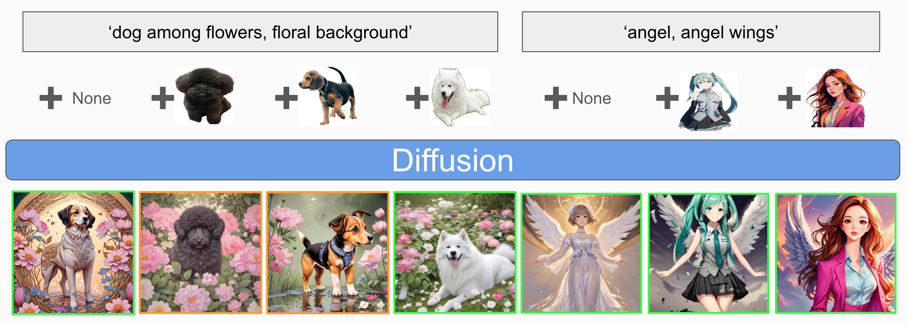
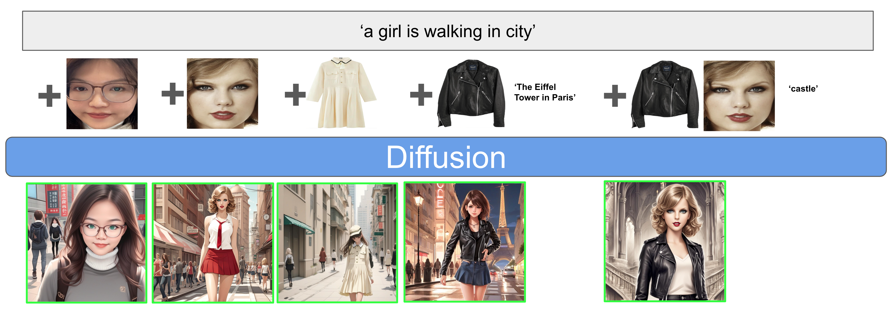
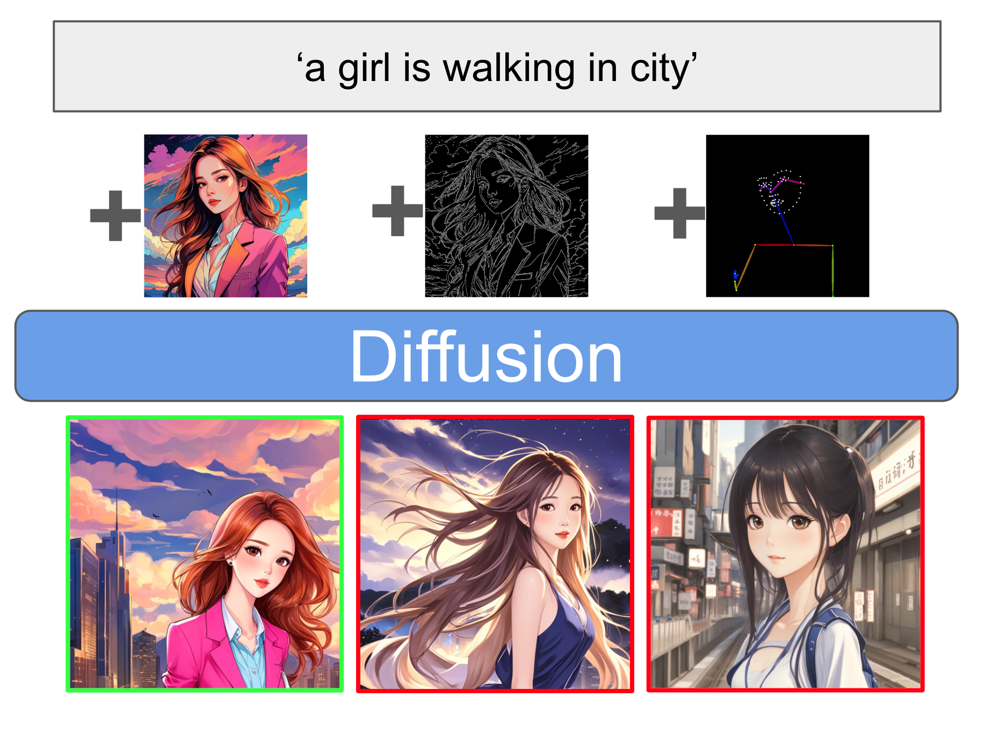

<h1>InstantUnify</h1>

[**Qixun Wang**](https://github.com/wangqixun)+ · [**Xu Bai**](https://github.com/Yue02280220)+ · [**Rui Wang**](https://wrong.wang/)+ · [**Haofan Wang**](https://haofanwang.github.io/)+*

InstantX Team

+equal contributions
*corresponding authors

InstantUnify integrates VLM into the diffusion model in the form of a plugin, enabling image-driven capabilities while maintaining the original text-to-image generation capabilities. We unify virtual fitting rooms, ID embedding, IP embedding, full-image embedding, and controlnet control into a singular visual embedding mode for images. As the variety of data formats expands, more tasks may be integrated in the future.

Training VLM requires significant computational power. Although the current InstantUnify checkpoint has demonstrated the effectiveness of this approach, the image quality and details are still not up to expectations. We are urgently training InstantUnify, and as the training progresses, we will periodically update the results of the latest checkpoints until the final version is determined. Stay tuned for updates.

# Demo
Current checkpoint: 24k

## Text-to-Image and IP-Guided Generation

Under the current checkpoint, the text-to-image generation will strictly follow the guidance. The main subject of the inserted image can generally maintain consistency in the generated image and conform to the direction of the text guidance. However, the details are not accurately preserved.

## ID-Guided and  Cloth-Guided Generation

Under the current checkpoint, although the ID and clothing can follow the guidance, the details are still not good enough. Conflict issues that may arise under multiple guidances have not occurred, thanks to the powerful comprehension ability of VLM.

## Control-Guided Generation

Under the current checkpoint, control in the form of controlnet is somewhat effective for guiding the entire image, but guidance for canny edges and pose is essentially ineffective. The bad cases displayed have been marked with red boxes.

# Todo

It feels necessary to continue training further. There is such a shortage of computing power!!!!!

