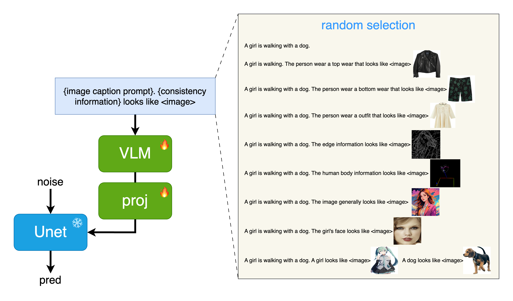

<h1>InstantUnify</h1>

[**Qixun Wang**](https://github.com/wangqixun) · [**Xu Bai**](https://github.com/Yue02280220) · [**Haofan Wang**](https://haofanwang.github.io/)*

InstantX Team

*corresponding authors

InstantUnify integrates VLM into the diffusion model in the form of a plugin, enabling image-driven capabilities while maintaining the original text-to-image generation capabilities. We unify virtual fitting rooms, ID embedding, IP embedding, full-image embedding, and controlnet control into a singular visual embedding mode for images. As the variety of data formats expands, more tasks may be integrated in the future.

Training VLM requires significant computational power. Although the current InstantUnify checkpoint has demonstrated the effectiveness of this approach, the image quality and details are still not up to expectations. We are urgently training InstantUnify, and as the training progresses, we will periodically update the results of the latest checkpoints until the final version is determined. Stay tuned for updates.